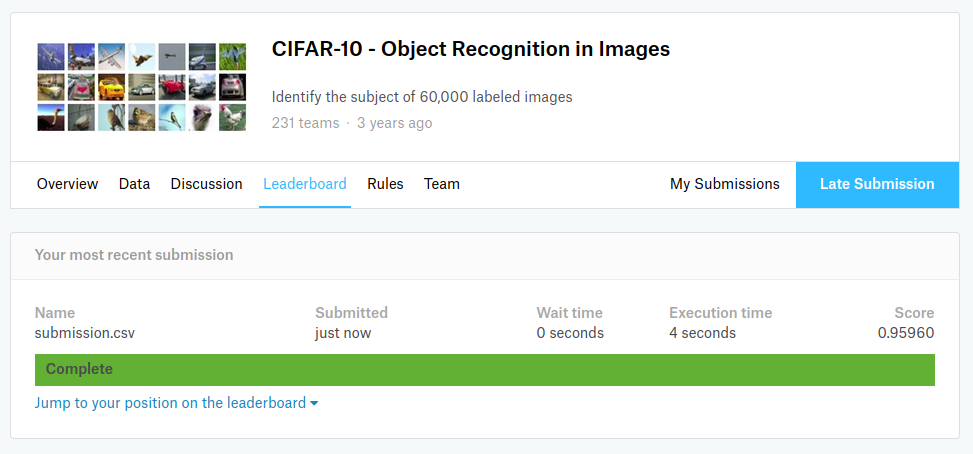
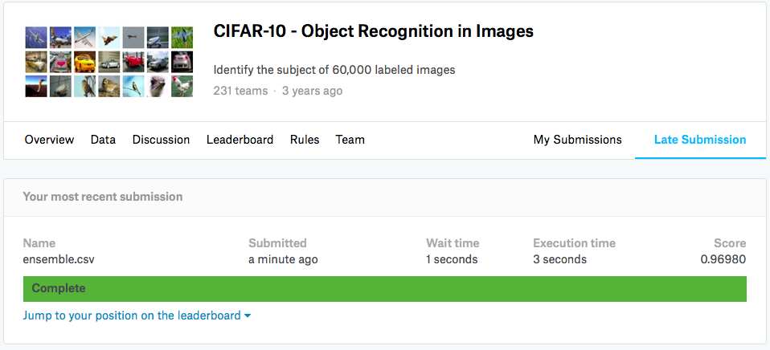

### 1. cifar10分类精度对比:

| 模型                  | 训练轮数 | 精度(%) | 平均每轮时间(s) |
| ------------------- | ---- | ----- | --------- |
| 1. mlp              | 140  | 53.78 | 1.0       |
| 2. lenet            | 80   | 69.62 | 1.8       |
| 3. lenet_aug        | 120  | 81.40 | 10.8      |
| 4. resnet50         | 60   | 88.07 | 30.1      |
| 5. resnet50_aug     | 160  | 94.20 | 47.8      |
| 6. wide_resnet16\*8 | 160  | 95.84 | 125.2     |
| 7. kaggle_single    | 160  | 95.96 | 118       |
| 8. kaggle_ensemble  | -    | 96.98 | -         |

- batch_size：128
- GPU：GTX 1070
- 其余具体参数见代码

注：在训练这些模型的同时，我在keras上进行了完全相同模型的训练，发现用mxnet和gluon训练的模型精度更高而时间的消耗反而更少，并且同样是高层封装，gluon搭建模型相比keras要更加直观和简洁，同时还能具有更多的灵活性。gluon的简洁对于学生和科研人员快速实现自己的想法非常友好，并且我也相信mxnet的高效在工业部署上也不输其他框架，剩下的就是如何将文档写的更加清晰具体易懂了。keras的对应代码我抽空再整理，近期应该是没有时间了。

### 2. 用于kaggle cifar10比赛用的WRN模型：

- 数据增强：meanstd预处理；图片pad到36\*36然后随机裁剪到32\*32；随机翻转

- 模型架构：带权层数1+9\*2+1=20层

    | 带权层  | channels | kernel_size | stride | 备注                  |
    | ---- | -------- | ----------- | ------ | ------------------- |
    | 1    | 16       | 3           | 1      | 单卷积层，2-10为block     |
    | 2    | 16\*8    | 3           | 1      | 用1\*1卷积匹配channel    |
    | 3-4  | 16\*8    | 3           | 1      |                     |
    | 5    | 32\*8    | 3           | 2      | output_size变为16\*16 |
    | 6-7  | 32\*8    | 3           | 1      |                     |
    | 8    | 64\*8    | 3           | 2      | output_size变为8\*8   |
    | 9-10 | 64\*8    | 3           | 1      |                     |
    | 11   | -        | -           | -      | Dense层              |

- 训练策略：

    1. 训练轮数：160

    2. decay策略：初始lr=0.1，60轮decay为0.02，120轮decay为0.004，140轮decay为0.0008

    3. weight decay = 5e-4

    4. 梯度下降：nesterov加速的sgd，momentum为0.9

- 比赛结果

    1. 单模型：95.96

        

    2. ensemble：96.98

        

        注：ensemble的代码单独给出，ensemble的其他模型数据均来自gluon社区小伙伴yinglang以及sherlock的分享，由衷感谢！由于是刷分用途的方法，个人对此兴趣不大，所以不详细讨论深究了，详细代码以及讨论可见[动手玩Kaggle比赛——使用Gluon对原始图像文件分类(CIFAR-10) 讨论区](https://discuss.gluon.ai/t/topic/1545/397)

        ensemble部分是在mac上跑的，代码参考至yinglang的[github](https://github.com/yinglang/CIFAR10_mxnet/blob/master/CIFAR10_train.md)，未经优化，细节部分还需根据具体情况调整

- load_data部分以及生成用于比赛提交结果的文件均参考沐神代码，具体可见[实战Kaggle比赛——使用Gluon对原始图像文件分类（CIFAR-10）](http://zh.gluon.ai/chapter_computer-vision/kaggle-gluon-cifar10.html)

### 3. 一些调参时的体会：

- 数据增强会减小训练准确率和测试准确率之间的差值，收敛也会变慢，不过一般会获得更好的效果。
- 从cifar-10的结果看，模型的改进能获得确实的效果。
- 更强的权重衰减有可能提升模型的精度。
- 过早或者过晚decay学习率都可能造成精度的下降，合适的decay策略对模型精度至关重要。

